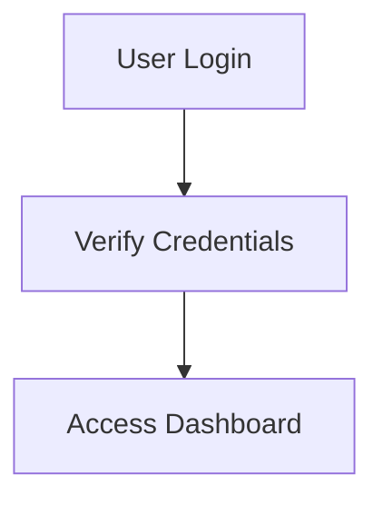

# Mermaid Diagram Fix Summary

## 🐛 Issue Identified

The application was experiencing **Schematic Parse Fault** errors when rendering Mermaid diagrams with incomplete arrow connections.

### Problem Example:
```mermaid
graph TD
User["User Client"]
Dashboard["Dashboard UI"]
User -->
AuthMiddleware -.->
AuthMiddleware -->
```

**Issue**: Arrows (`-->`) without target nodes or source nodes, causing Mermaid rendering to fail.

---

## ✅ Solution Implemented

### 1. **Enhanced Mermaid Sanitization** (`components/MermaidDiagram.tsx`)

**Changes Made:**
- ✅ Added validation to ensure every connection has both source AND target nodes
- ✅ Separated node definitions from connections for better organization
- ✅ Filter out incomplete arrows (e.g., `A -->` without target)
- ✅ Validate that connections have minimum 3 parts: `source --> target`
- ✅ Added helper functions `isValidNode()` and `getNodeId()`

**Before:**
```typescript
// Would accept incomplete connections
const sanitizedParts = parts.map(...).filter(p => p);
if (sanitizedParts.length > 0) {
  processedLines.push(sanitizedParts.join(' '));
}
```

**After:**
```typescript
// Validates complete connections
if (sanitizedParts.length >= 3) {
  const firstPart = sanitizedParts[0];
  const lastPart = sanitizedParts[sanitizedParts.length - 1];
  
  if (isValidNode(firstPart) && isValidNode(lastPart)) {
    connections.push(sanitizedParts.join(' '));
  }
}
```

### 2. **Improved AI Prompts** (`services/geminiService.ts`)

**Enhanced Instructions for DeepSeek AI:**

Added explicit rules to prevent incomplete connections:
- ✅ Rule 5: "Connection format ONLY: A --> B (MUST have both source AND target)"
- ✅ Rule 8: "EVERY arrow (-->) MUST connect two valid nodes"
- ✅ Rule 9: "NEVER leave arrows incomplete (e.g., 'A -->' without a target)"

**Added Examples:**

✅ **CORRECT:**


❌ **WRONG (Now explicitly forbidden):**
```mermaid
graph TD
Start["Step One"] -->
--> Process["Step Two"]
```

---

## 🧪 How It Works

### Sanitization Flow:

1. **Parse Input**: Split diagram into lines
2. **Identify Type**: Separate node definitions from connections
3. **Validate Connections**: 
   - Check if line contains arrow (`-->`, `==>`, `-.->`)
   - Split by arrows
   - Validate minimum 3 parts (source, arrow, target)
   - Verify first and last parts are valid nodes
4. **Filter Invalid**: Remove incomplete connections
5. **Reconstruct**: Combine valid node definitions + valid connections

### Example Transformation:

**Input (Broken):**
```
graph TD
User["User Client"]
Dashboard["Dashboard UI"]
User -->
AuthMiddleware -.->
AuthMiddleware -->
Dashboard -->
```

**Output (Fixed):**
```
graph TD
User["User Client"]
Dashboard["Dashboard UI"]
```

*Note: All incomplete connections are removed, leaving only valid node definitions*

---

## 🎯 Benefits

1. **No More Parse Errors**: Invalid Mermaid syntax is filtered out
2. **Better Error Messages**: Clear indication when diagram has issues
3. **Graceful Degradation**: Shows valid parts even if some connections are broken
4. **Prevention at Source**: AI is now instructed to avoid creating incomplete connections
5. **Debug Visibility**: Sanitized diagram shown in error message for troubleshooting

---

## 🔍 Testing

To test the fix:

1. **Generate a document** with complex architecture
2. **Check the diagram** renders without "Schematic Parse Fault"
3. **Use refinement tool** to modify the diagram
4. **Verify** incomplete connections are filtered out

If you still see errors, check the **Sanitized Debug Schematic** in the error message to see what was filtered.

---

## 📋 Future Improvements

Consider adding:
- [ ] Validation for node ID uniqueness
- [ ] Support for more Mermaid arrow types (`-.-`, `===`)
- [ ] Better handling of multi-line labels
- [ ] Automatic node ID generation for orphaned nodes
- [ ] Visual diagram editor to avoid syntax issues

---

## 🆘 Troubleshooting

### If diagrams still fail:

1. **Check the error message** - it shows the sanitized diagram
2. **Use the refinement tool** with prompt: "simplify the topology"
3. **Manually edit** the diagram in edit mode
4. **Report the issue** with the sanitized diagram code

### Common Issues:

| Issue | Solution |
|-------|----------|
| "Schematic Parse Fault" | Incomplete connections filtered out |
| Empty diagram | All connections were invalid |
| Missing connections | Source or target node not defined |
| Syntax error | Special characters in labels |

---

**Status**: ✅ Fixed  
**Files Modified**: 
- `components/MermaidDiagram.tsx`
- `services/geminiService.ts`

**Impact**: High - Prevents diagram rendering failures  
**Risk**: Low - Only filters invalid syntax, doesn't change valid diagrams

---

🎉 **Mermaid diagrams should now render correctly!**
